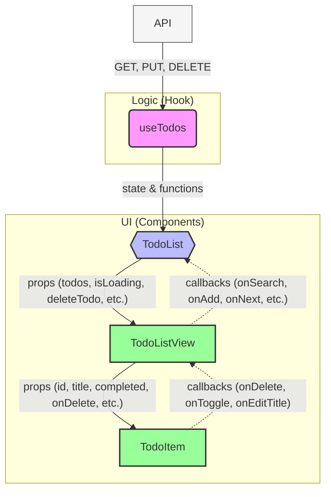

# To-Do List App — Component Tree + Data Flow

## Data Flow
- Props Down: TodoList → TodoListView → TodoItem (passes data & callbacks)
- Callbacks Up: TodoItem → TodoList (container) → useTodos (hook) → API & local state
- useTodos performs API queries:
  - GET /todos?limit={limit}&skip={skip}
  - PUT /todos/{id} (toggle, edit)
  - DELETE /todos/{id}
- Search: client-side filter applied to current page's todos (case-insensitive)
- Pagination: hook manages currentPage/limitPerPage/totalTodos via API `limit` & `skip`

### Patterns used
- Custom Hook (useTodos) — encapsulation of data logic and side effects
- Container / Presentational separation (TodoList container, TodoListView/TodoItem presentational)
- Prop drilling (props down, callbacks up)
- Pessimistic updates for edit/toggle/delete (state updated after API success)
- Client-side add & search (local state)
