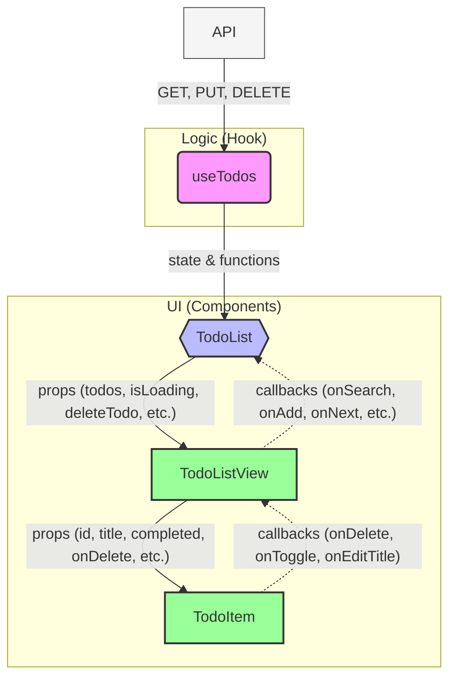

# To-Do List App — Component Tree + Data Flow

## Data Flow
Передача props вниз: TodoList → TodoListView → TodoItem (передаються дані та callback-функції).
Виклик callbacks вгору: TodoItem → TodoList (контейнер) → useTodos (хук) → API та локальний стан.
  useTodos виконує API-запити:
-GET /todos?limit={limit}&skip={skip}
-PUT /todos/{id} (для перемикання статусу та редагування)
-DELETE /todos/{id}

Пошук: Фільтрація на стороні клієнта, яка застосовується до завдань на поточній сторінці (регістронезалежна).
Пагінація: Хук керує станами currentPage, limitPerPage, totalTodos через API-параметри limit та skip.

### Patterns used
Кастомний хук (useTodos) — інкапсуляція логіки роботи з даними та побічних ефектів (сайд-ефектів).
Розділення на контейнерні та презентаційні компоненти (Container / Presentational) — TodoList як контейнер, TodoListView/TodoItem як презентаційні.
Прокидування пропсів (Prop drilling) — props передаються вниз, callbacks викликаються вгору.
Песимістичні оновлення (Pessimistic updates) для редагування/перемикання/видалення — стан оновлюється після успішної відповіді від API.
Додавання та пошук на стороні клієнта (через локальний стан).
