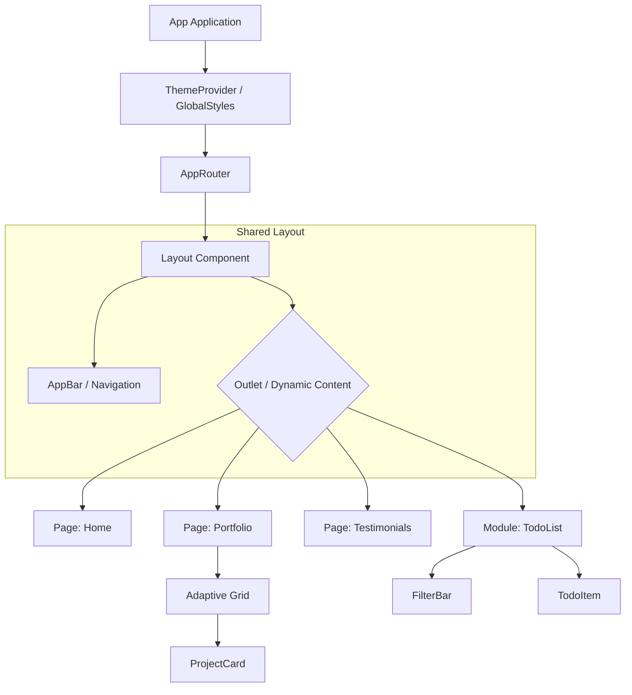

# Final Project: Developer Portfolio & Task Manager

Цей веб-додаток є фінальним проєктом, що демонструє навички роботи з React, Zustand та Material UI.

## Структура проєкту

Організація файлової системи базується на розділенні відповідальності:

```text
src/
├── components/          # (Presentational) компоненти (Layout, Cards)
├── data/                # Константні дані
├── pages/               # Компоненти-сторінки (Home, Portfolio, Testimonials)
├── store/               # Zustand Store (глобальний стейт-менеджмент)
├── theme/               # Конфігурація теми (Dark/Light mode, Global Styles)
├── AppRouter.jsx        # Маршрутизація
└── main.jsx             # Точка входу
```

## Архітектурні рішення *

Ключові технічні рішення, прийняті під час розробки для забезпечення якості коду.

### 1. State Management (Zustand)
Для управління станом завдань (Todo List) використано бібліотеку **Zustand**.
* **Реалізація:** Стор містить методи `addTodo`, `removeTodo`, `toggleTodo`, які компоненти викликають напряму.

### 2. Service Layer Pattern (Шар сервісів)
Взаємодію з API винесено в окремий модуль, щоб ізолювати логіку запитів від компонентів.

### 3. Advanced Theming & UX Fixes
Реалізовано систему темної/світлої теми через `MUI ThemeProvider` та `GlobalStyles`. Вирішено проблему контрастності елементів форм у темній темі.

### 4. Layout & Routing Strategy
Використано компонент-обгортку `Layout` з React Router для стабільної навігації.

## Component Tree *

Візуалізація ієрархії компонентів:

